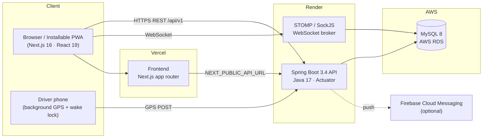
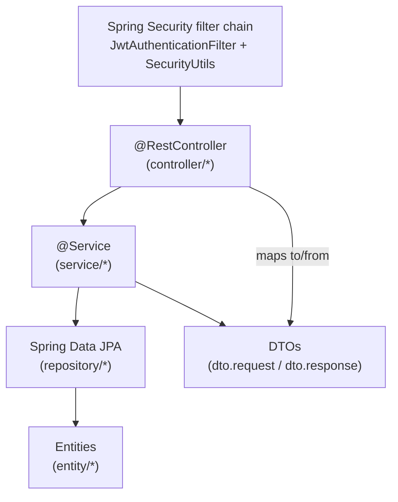

# System architecture

## High-level components

## Request path

1. Browser loads the Next.js app from **Vercel**.
2. The app calls the Spring Boot API on **Render** at `NEXT_PUBLIC_API_URL` (base path `/api/v1`).
3. The API authenticates each request with a JWT bearer token and enforces role + school scoping.
4. Persistent data lives in **MySQL on AWS RDS**; schema is owned by **Flyway** migrations.
5. Live location updates flow over **STOMP/SockJS** (with a REST fallback for the driver GPS post).
6. Optional push notifications are delivered via **Firebase Cloud Messaging**.

## Backend layering

- **Controllers** expose REST endpoints under `/api/v1/...` and return a uniform `ApiResponse<T>` envelope.
- **Services** hold business logic and transaction boundaries (`@Transactional`).
- **Repositories** are Spring Data JPA; school-scoped queries use `findBySchoolId...` methods.
- **`SecurityUtils.getCurrentSchoolId()`** resolves the tenant for the logged-in user so admins only ever
  touch their own school's data.

## Frontend structure

- App Router under `src/app/(dashboard)/<portal>/...` — one folder per role/portal.
- `AuthGuard` wraps each portal layout and checks the user's roles before rendering.
- `services/*.ts` wrap Axios calls; `types/*.ts` mirror backend DTOs.
- `hooks/use-driver-location.ts` runs a `DriverLocationRuntime` singleton so GPS keeps flowing while the
  driver navigates between screens or minimizes the app (wake lock + `localStorage` persistence + offline queue).
- Maps are rendered with Leaflet via `components/maps/live-map*.tsx`.

## Deployment topology

| Layer | Host | Notes |
| --- | --- | --- |
| Frontend | Vercel | Env: `NEXT_PUBLIC_API_URL` |
| Backend | Render (Docker) | Binds `0.0.0.0:$PORT`; profile `prod`; env: `DB_URL`, `JWT_SECRET`, `CORS_ALLOWED_ORIGINS` |
| Database | AWS RDS (MySQL 8) | Flyway runs migrations on boot |

See [`../developer-guides/deployment.md`](../developer-guides/deployment.md) for step-by-step deployment.
