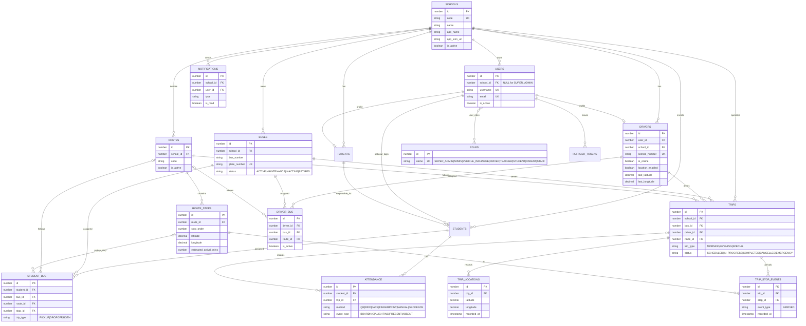
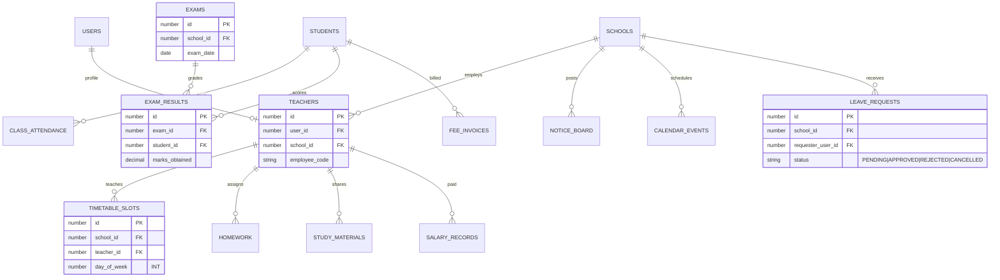

# Entity relationship diagram

Reflects the MySQL schema created by Flyway migrations `V1` (core) and `V5` (branding + academic SIS).
Audit/settings tables are omitted from the visual for readability.

## Core transport & auth

## Academic SIS (V5)

## Notes

- **Multi-tenancy:** almost every table carries `school_id`. `SUPER_ADMIN` users have `school_id = NULL`.
- **Roles are many-to-many** via the `user_roles` join table.
- **Live tracking** reads `trips` (active), `trip_locations` (breadcrumbs), `route_stops` (the ordered stop
  list with ETA), and the driver's `last_latitude/last_longitude`.
- Full column-level definitions live in the migrations; see
  [`../developer-guides/database-and-migrations.md`](../developer-guides/database-and-migrations.md).
