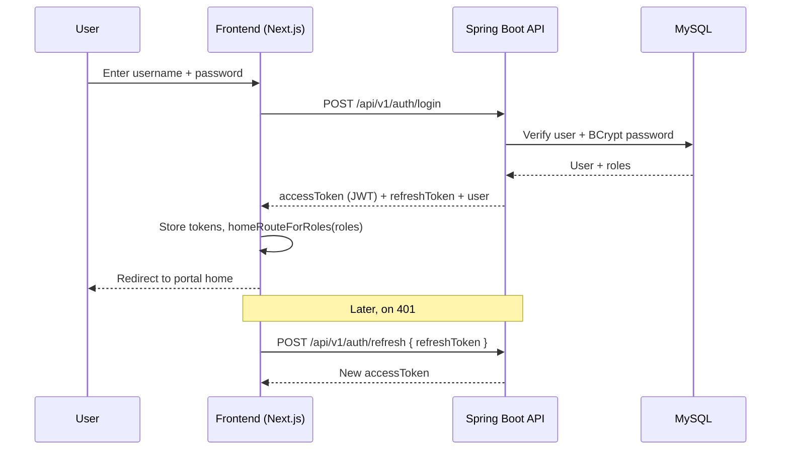
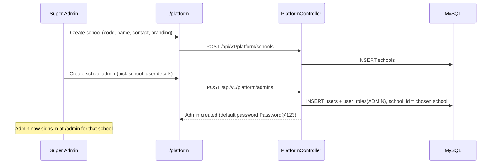
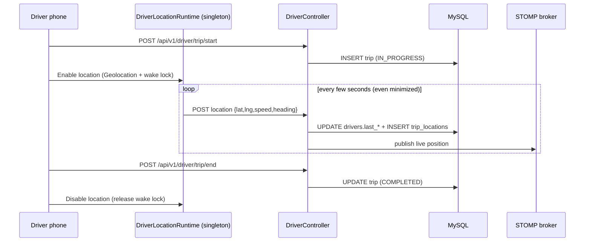
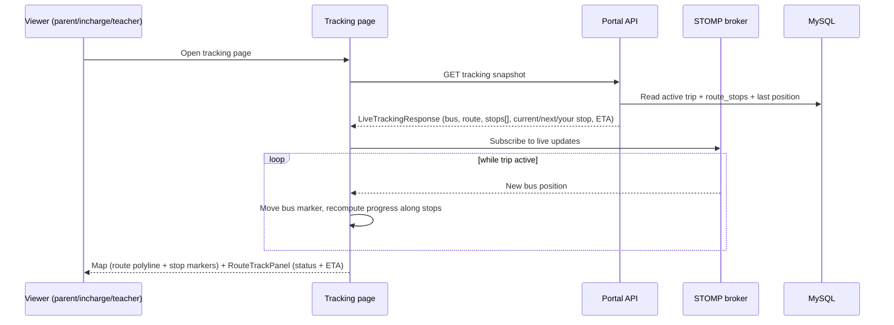
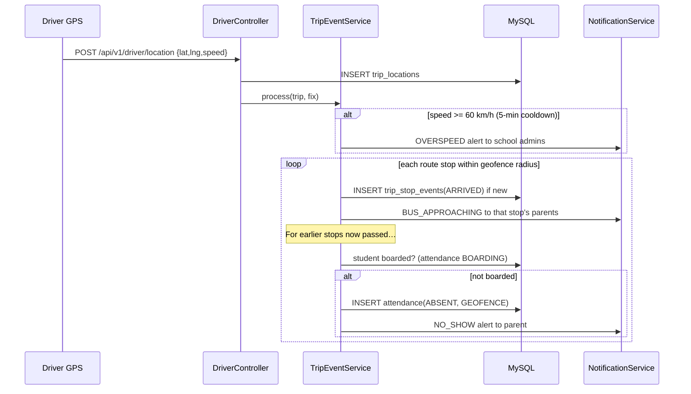
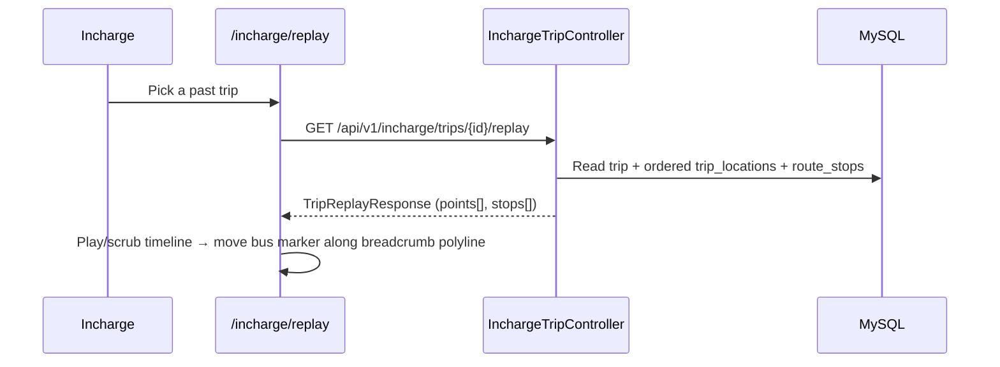

# Sequence flows

## 1. Authentication (login + refresh)

## 2. School provisioning (SUPER_ADMIN)

## 3. Driver trip + background GPS

Notes:
- The runtime persists `enabled` in `localStorage` and queues fixes offline, so GPS survives screen changes,
  minimizing, and brief network drops.
- `enable()` returns an error message string (or `null` on success) so the UI can explain permission/HTTPS issues.

## 4. Live tracking with route stops & ETA (student/parent, incharge, teacher)

## 5. Automatic trip events: geofence, overspeed, no-show

Boarding is captured by the driver on the manifest (`POST /driver/students/{id}/board` → `attendance BOARDING`,
which also fires `STUDENT_PICKED`). Overspeed de-dupe is in-memory per trip (single-instance deployment).

## 6. Trip replay (Vehicle Incharge)

Keep these diagrams in sync whenever the corresponding controllers, hooks, or pages change.
