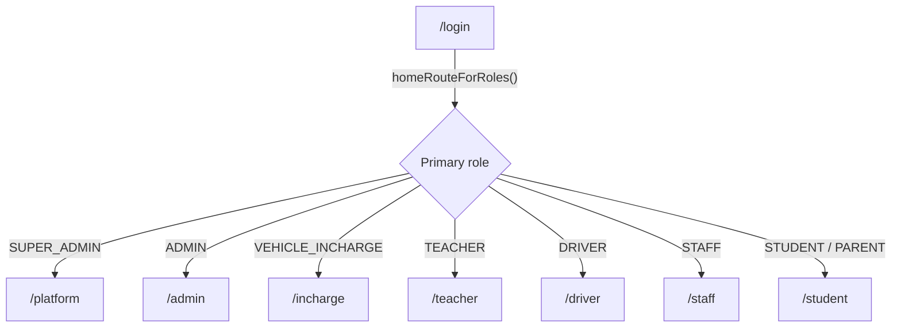

# Roles & portals

## Role → portal → home route



When a user has multiple roles, the **highest-priority** role decides the home route. Priority order
(from `src/lib/constants.ts`, `ROLE_HOME_PRIORITY`):

```
SUPER_ADMIN > ADMIN > VEHICLE_INCHARGE > TEACHER > DRIVER > STAFF > STUDENT > PARENT
```

## Capability matrix

| Capability | SUPER_ADMIN | ADMIN | VEHICLE_INCHARGE | DRIVER | TEACHER | STUDENT/PARENT | STAFF |
| --- | :-: | :-: | :-: | :-: | :-: | :-: | :-: |
| Create schools | ✅ | | | | | | |
| Create school admins | ✅ | | | | | | |
| Manage students / parents | | ✅ | | | | | |
| Manage teachers | | ✅ | | | | | |
| Manage vehicle incharges | | ✅ | | | | | |
| Manage buses / routes / stops | | | ✅ | | | | |
| Driver–bus / student–bus assignments | | | ✅ | | | | |
| Start/end trip, SOS, share GPS | | | | ✅ | | | |
| View manifest + check students boarded/absent | | | | ✅ | | | |
| Live fleet tracking (all buses) | | ✅ | ✅ | | ✅ (availability) | | |
| Replay past trips (GPS playback) | | | ✅ | | | | |
| Track own/child's bus + route stops + ETA | | | | | | ✅ | |
| Auto alerts: bus approaching / no-show (parents), overspeed (admins) | | ✅ | | (source) | | ✅ | |
| Analytics dashboard + audit log | | ✅ | | | | | |
| Enter exam results / see published results | | | | | ✅ | ✅ (view) | |
| Notices & calendar | | ✅ | | | ✅ | ✅ | ✅ |

## Scoping rules

- **`SUPER_ADMIN`** is the only cross-tenant role (`school_id = NULL`); it works exclusively in `/platform`
  through `/api/v1/platform/**`.
- Every other role is bound to a single `school_id`. Controllers resolve it via
  `SecurityUtils.getCurrentSchoolId()` and repositories filter with `findBySchoolId...` queries.
- **Vehicle incharge management** lives in the **Admin** portal (`/admin/vehicle-incharges` →
  `/api/v1/admin/vehicle-incharges`), so each school owns its own fleet managers.

See [`../developer-guides/security-and-auth.md`](../developer-guides/security-and-auth.md) for the exact
Spring Security path rules.
