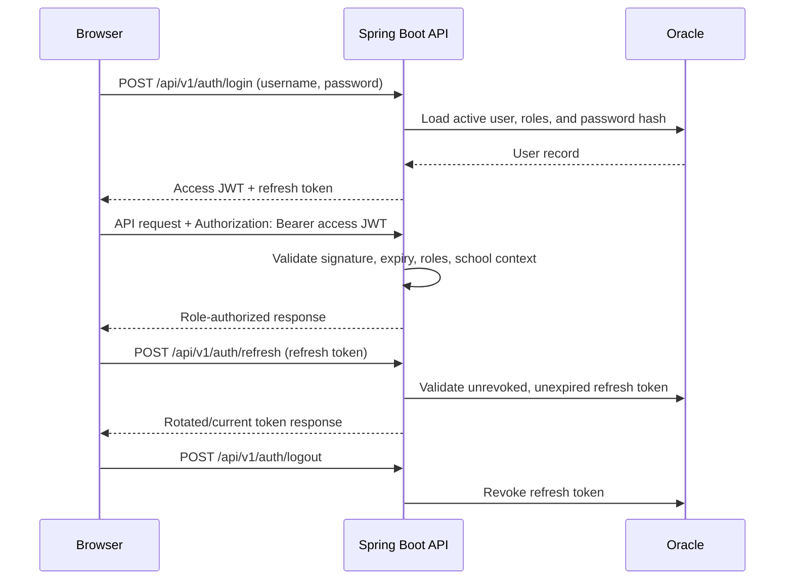
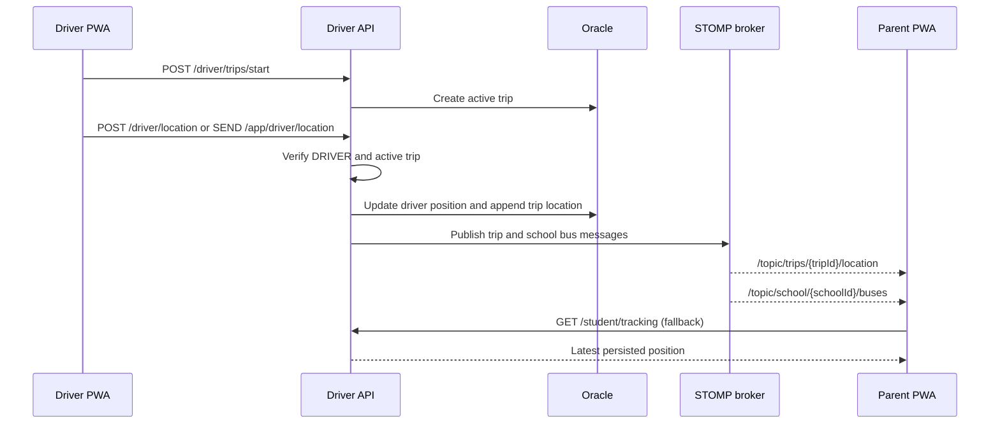

# Architecture

Vidya Bus uses a browser frontend, a Spring Boot API, a STOMP/SockJS live-update channel, and Oracle Free. The backend is school-scoped: services derive the authenticated user and operate only within that user's school context.

## Layered backend

```mermaid
flowchart TB
  UI[Next.js PWA]
  UI -->|HTTPS REST| C[Controllers]
  UI -->|STOMP/SockJS| WS[WebSocket controller]
  C --> SEC[Spring Security / JWT filter]
  WS --> WSA[WebSocket auth interceptor]
  SEC --> S[Application services]
  WSA --> S
  S --> R[Spring Data repositories]
  S --> N[Notification / FCM service]
  S --> B[Live tracking broker]
  R --> DB[(Oracle Free)]
  B -->|/topic/trips/{id}/location| UI
  B -->|/topic/school/{id}/buses| UI
  N --> FCM[Firebase Cloud Messaging\noptional]
```

- **Controllers** expose versioned REST endpoints and validate request DTOs.
- **Security** authenticates bearer tokens and enforces role/school access before business operations.
- **Services** contain domain rules for assignments, trips, tracking, reporting, and notifications.
- **Repositories/entities** map to Oracle tables. Flyway owns DDL; Hibernate validates it at startup.
- **WebSocket** uses STOMP over SockJS at `/ws`, with app messages under `/app` and subscriptions under `/topic`.

## Authentication flow



Access tokens are short-lived (15 minutes by default); refresh tokens default to seven days. Production deployments must replace the development `JWT_SECRET`.

## Live tracking flow



The frontend falls back to periodic REST tracking when its live connection fails. The current broker is in-memory; see the scaling notes in [DEPLOYMENT.md](DEPLOYMENT.md) before running multiple backend replicas.
