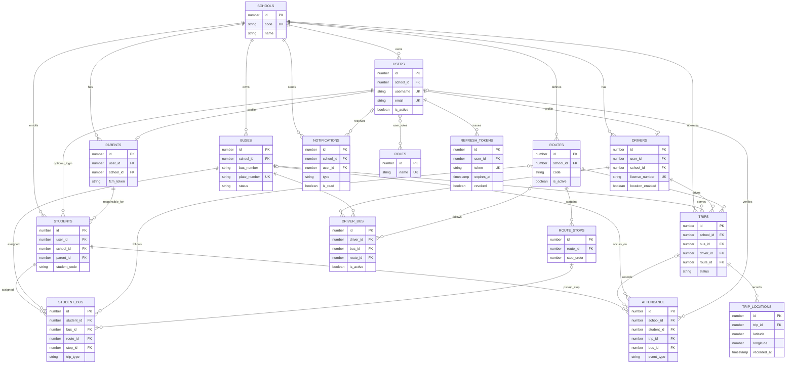

# Entity relationship diagram

The diagram focuses on application tables used by authentication, transport operations, tracking, notifications, and reporting. Audit/settings tables are omitted from the visual for readability.

